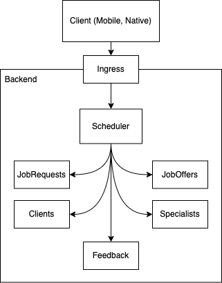
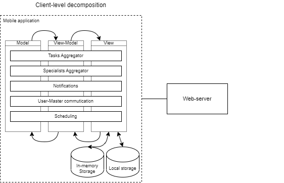
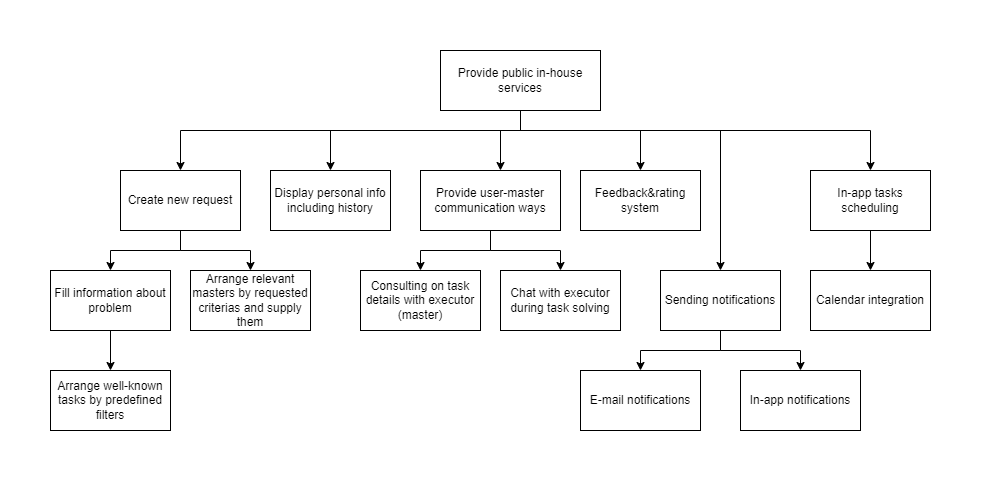

# Team - Skitle

# Task 4 – Design 

## Part I – Overall design and subsystem decomposition

### Overall Design

Our application will be implemented as a typical Client-Server app because we have a distinc
need for a separate client interaction layer (client) and a complex data processing layer (server).

Our clients will be implemented in a form of native mobile applications and server-side will follow
microservice architecture.

As our general design strategy, we chose Object Oriented Design as it allows us to easily 
design system to be scaled for each independent object domain. Independent component scaling
is crucial to our system.

### Subsystems decomposition

### Functional decomposition

## Part II – Main components and modules of the product and their levels of Reusability

### Main Components

## Server components

1. Scheduler – matchmaking between the clients and the specialists, responsible for job statuses
2. JobRequests – managing all job requests from clients
3. JobOffers – managing all job offers from specialists
4. Clients – managing clients and their profiles
5. Specialists – managing specialists and their profiles
6. Feedback – managing and ingesting user feedback for various statistics and scheduler
7. Ingress – single backend ingress point of the system. Manages authentication using other services
8. Client (Mobile) – user-facing component of the system

## App components

9. Tasks(Job) Aggregator - matching all own job requests for users and active/available job requests for specialists
10. Specialists Aggregator - matching all specialists sutable for requests
11. Notifications - subsystem destined for sending different types of notifications for both users/specialists
12. User-Master(specialist) communication - subsystem destined for bidirectional communication between user and specialist during requests/consultations

### Reusability

In general, all server components are developed guided by active approach. The developed services can be reused for all types of clients (web, mobile), which is facilitated by the architecture we have chosen.
Such components include: scheduler, JobRequests, JobOffers, Clients, Specialists, Feedback, Ingress.
At the same time, some of the above components will be reused by another: Clients and Specialists components will be reused by JobRequests, JobOffers, Feedback, Scheduler.
Moreover, some of the components can reuse third-party services (for example, cloud ones): Notification (from App components) can use services to send notifications (for example, Firebase).
Client services, on the other hand, will most often be tightly coupled to the host platform, making cross-platform reuse difficult.

Passive approach: Tasks(Job) Aggregator, Specialists Aggregator, Notifications, User-Master(specialist) communication, Clients, Specialists, JobRequests, JobOffers, Feedback, Schedule
Active approach: Schedule, JobRequests, JobOffers, Clients, Specialists, Feedback, Ingress

System reuse:

1. Ingress - is used by all systems to ingest various data into requests
2. Client (Mobile) – is used for all user-facing features

Application reuse:

1. Databases (long-term and caches) – Redis, Postgres etc..
2. Telemetry components (logs, metrics, traces) – Grafana, Prometheus, Jaeger, Loki, etc...
3. Deployment systems – all services will be used under shared environments through the means of containerization