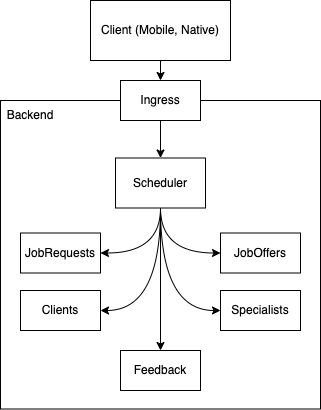

# Team - Skitle

# Task 4 – Design 

## Part I – Overall design and subsystem decomposition

### Overall Design

Our application will be implemented as a typical Client-Server app because we have a distinc
need for a separate client interaction layer (client) and a complex data processing layer (server).

Our clients will be implemented in a form of native mobile applications and server-side will follow
microservice architecture.

As our general design strategy, we chose Object Oriented Design as it allows us to easily 
design system to be scaled for each independent object domain. Independent component scaling
is crucial to our system.

### Subsystem decomposition

## Part II – Main components and modules of the product and their levels of Reusability

### Main Components

1. Scheduler – matchmaking between the clients and the specialists, responsible for job statuses
2. JobRequests – managing all job requests from clients
3. JobOffers – managing all job offers from specialists
4. Clients – managing clients and their profiles
5. Specialists – managing specialists and their profiles
6. Feedback – managing and ingesting user feedback for various statistics and scheduler
7. Client (Mobile) – user-facing component of the system
8. Ingress – single backend ingress point of the system. Manages authentication using other services

### Reusability

System reuse:

1. Ingress - is used by all systems to ingest various data into requests
2. Client (Mobile) – is used for all user-facing features

Application reuse:

1. Databases (long-term and caches) – Redis, Postgres etc..
2. Telemetry components (logs, metrics, traces) – Grafana, Prometheus, Jaeger, Loki, etc...
3. Deployment systems – all services will be used under shared environments through the means of containerization

Component reuse:

1. All services will use same SDK for inter-service communication
2. All services will use same SDKs for 3rd party components integration (database drivers, etc...)
